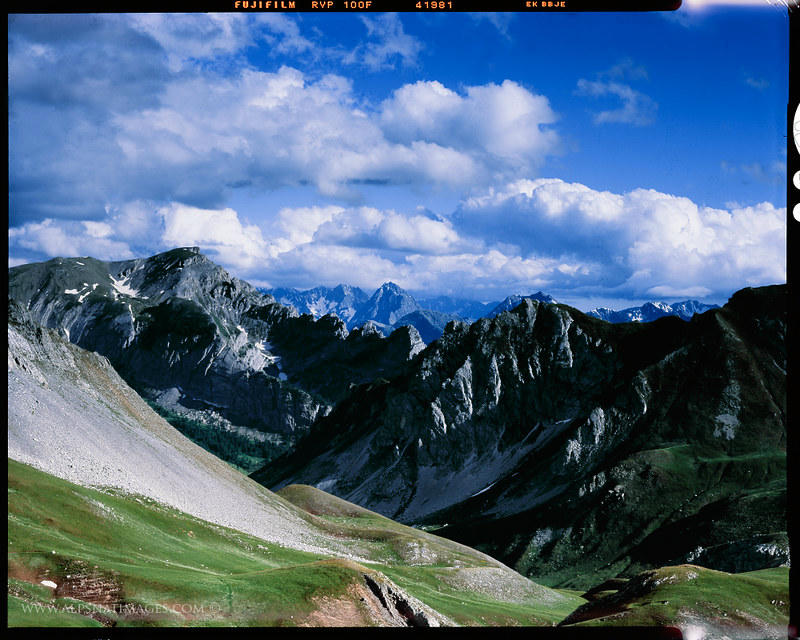
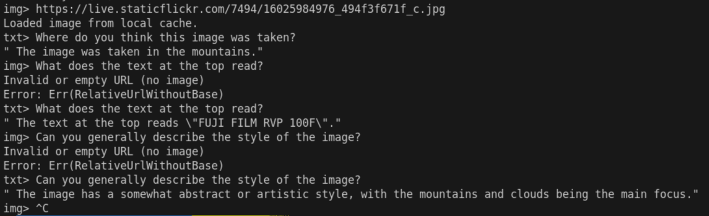

# SmolVLM Test

Just testing SmolVLM in Rust via Candle and tokenizer.

It has a working text and image interface via CLI. Currently, it only takes in at most one image mostly as a proof of concept for Rust implementation.

Here's a sample with a given image (as a url when prompting in CLI):

Ignore the second and third image prompts, I keep accidentally typing into it.

With SmolVLM's emphasis on OCR, it is quite good in retrieving the small texts at the top edge.

## How to use
`img> ` Paste in a URL. If invalid, empty, or more than one image already prompted, it will continue as if no images were inputted.
`txt> ` Text prompt.

## Short-term goals
-[ ] Add KV Caching for faster inference speed
-[ ] Experiment with real-time image processing (interpreting images and undestand each frame)
-[ ] (Maybe) multiple images and interleaving images

## Rust
1. I think it shows implementing LLMs are feasible with `candle`, since it provided a lot of useful basic tensor operations. (Almost 1-1 to PyTorch)
2. With `tokenizer` crate already well developed for common use case and `candle` already providing a lot of its own implementation of popular open-source models, kornia-rs can definitely rely on `candle` to integrate VLMs and 3D-LLMs with its fast differentiable vision processing functionalities.

# Analysis
Things I've noticed just from playing around with model:

## 1. Big Images => Image Collage!
When I provide SmolVLM with high-resolution image, the image preprocessing pipeline would reasonably split the images into multiple patches. However, the more splits there are, the likelier SmolVLM notices this and interprets as a collage of images despite the `<row_y_col_x>` tokens and newlines after each row of patches, though it does help in the case of asking where the features are located in the image.

## 2. Previous Response Taking Over
Sometimes when I ask SmolVLM to describe the image, it goes on multiple lines taking a lot of the space in the message string. So when I asked again for a different question, I think the weight/share of the previous response kind of overwhelms and takeover the answering of the next prompt. I theorize if I prompt SmolVLM with a similiar length as the previous response, it might balance the weight of the whole message again.

# Learning Experience

- Learned multimodal LLMs are conceptually easier than thought
    - Like SmolVLM, multimodal LLMs can interpret images via image encoder which transforms images into token embeddings which would just be
    directly merged with other tokens for the text model itself. No cross attention and other complicated shenanigans.
- Biggest difficulties:
    - Getting swapping the weight values in MLPGates
    - Setting the scaled attention product to the full hidden dim (2048) instead of per head dimension (32)
    - Installing `candle-fast-attention` which (for no reason) uses parallel build process for all the CUDA kernels, filling up my swap space and freezing my laptop (took a while to realize)
    - Images are not being properly interpreted and mapped to token embedding space, producing random gibberish when an image is given.
        - Had to transpose back the attention (took a while to find out)
            - Now it's producing legible natural language but completely misinterprets the images
        - Replacing `candle`'s GELU with custom GELU approximated with tanh (which the Python impl. uses)
            - No effect
        - Realized I had the entire attention layer skipped by referring `xs` instead of `x` in attention module.
- Biggest surprise:
    - LLMs are given a Jinja template to structure the raw message input with special tokens. Before, I did not realize all this was happening
    within Python's `transformer` library.
    - LLMs are really *really* just bunch of math operations. After implementing my first LLM in Rust (SmolVLM), it changes how you see LLM now that you know how each math operation works under the hood. They're just a bunch of embedding transformations (things you use in vector databases), layer norms (similiar to batch norms), and transformers (i.e., scaled dot products (and also MLPs))
